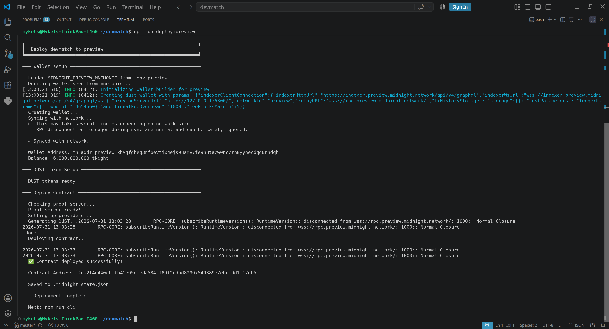

# DevMatch

> A privacy-first developer team-matching platform built on [Midnight](https://midnight.network). Developers register a zero-knowledge commitment of their skills and availability; a ZK match circuit proves compatibility with a project without revealing the raw data.

Built for the [Midnight Full Moon Builder Program](https://www.risein.com/programs/new-moon-to-full-monthly-moonshots-on-midnight)

---

## Live Demo

> Placeholder. A Vercel/Netlify link will live here after the Level 2 frontend is deployed.

---

## Contract Address

| Network  | Address                                                          |
|----------|------------------------------------------------------------------|
| Preview  | `2ea2f4d440cbffb41e95efeda584cf8df2cdad82997549389e7ebcf9d1f17db5` |
| Preprod  | not yet deployed                                                  |

Deployed on **2026-07-31** with `npm run deploy:preview`. The address is also recorded in `.midnight-state.json` (I gitignored this because it contains wallet seeds).

Proof of deployment (Preview):



---

## What This Does

DevMatch is a developer registration registry on Midnight. A developer fills in their skills, experience, and availability; the browser hashes that data into a 32-byte commitment (SHA-256) and calls the `registerProfile` circuit on-chain. Nothing sensitive is ever written to the ledger.

For level 3, i plan on implementing a match circuit which will prove that a developer's private profile satisfies a project's requirements (stack overlap, years of experience, available hours) without the project ever seeing the raw profile.

---

## Privacy Model

- **What is PUBLIC:** the commitment hash, the trust tier (`Yellow`/`Green`), the reveal policy, and the caller's derived on-chain identity (a `persistentHash` of a secret key, domain-separated with `"devmatch:caller:"`).
- **What is PRIVATE:** the raw profile data (name, stack, years, hours) — it is hashed in the browser and never sent to the network.
- **What the user PROVES without revealing:** that they hold a profile whose commitment matches the on-chain value. The circuit's witness is the raw data + secret key; only the derived commitment and caller ID are disclosed.

## Privacy Claim

An on-chain observer sees only a 32-byte commitment, a tier, a policy, and a pseudo-anonymous caller ID. They **cannot** reconstruct the developer's stack, experience, or availability from the ledger — the raw data exists only in the developer's own browser.

---

## Tech Stack

- **Smart contracts:** Compact (Midnight's zero-knowledge contract language), compiled with `compact` v0.31.x
- **Toolchain:** Node.js v22, Docker (proof server), Yarn
- **Networks:** Preview / Preprod
- **Wallet:** Lace (Midnight Preview/Preprod)
- **Frontend (Level 2):** React + Vite + TypeScript, Midnight.js SDK, Lace dApp connector
- **Tests:** Vitest + `@midnight-ntwrk/testkit-js`

---

## Prerequisites

- [Node.js](https://nodejs.org) v22+
- [Compact toolchain](https://github.com/midnightntwrk/compact) v0.31.x (`compact` on PATH)
- [Docker](https://docs.docker.com/get-docker/) — for the proof server
- [Yarn](https://yarnpkg.com) v1.22+ (optional, npm works too)
- [Lace wallet](https://chromewebstore.google.com/detail/lace/afkphoeejbbklcjcagepaknnnmjjkkff) — for the Level 2 frontend

---

## Run Locally

### 1. Clone and install

```bash
git clone https://github.com/Mykelsown/devmatch.git
cd devmatch
npm install
```

### 2. Compile the contract

```bash
npm run compile
```

Expected output:

```text
Compiling 1 circuits:
  circuit "registerProfile" (k=13, rows=4484)
```

### 3. Start the proof server (separate terminal)

```bash
docker run -p 6300:6300 midnightntwrk/proof-server:latest midnight-proof-server -v
```

### 4. Set up wallet env files

Copy your funded mnemonics into `.env.preview` and `.env.preprod` (you will have to create those on your local device):

```bash
MIDNIGHT_PREVIEW_MNEMONIC="your 24-word preview mnemonic here"
```

Fund the derived addresses from the testnet faucets if needed:

- Preview: <https://midnight-tmnight-preview.nethermind.dev/>
- Preprod: <https://midnight-tmnight-preprod.nethermind.dev/>

### 5. Deploy

```bash
npm run deploy:preview      # or npm run deploy:preprod
```

### 6. Run the tests

```bash
npm run test:local          # local devnet (docker compose)
npm run test:preview
npm run test:preprod
```

### 7. Run the frontend (Level 2)

```bash
cd frontend
npm install
npm run dev
```

Open the URL Vite prints (default `http://localhost:5173`), connect Lace, and register a Yellow-tier profile.

---

## Project Structure

```text
devmatch/
├── contracts/
│   ├── dev_profile.compact       # Level 1/2 registry contract
│   ├── index.ts                  # contract exports + CompiledDevMatchContract
│   └── managed/                  # compact compile output (gitignored, regenerate with npm run compile)
├── src/
│   ├── config.ts                 # network configs (local, preview, preprod)
│   ├── deploy.ts                 # deployment script
│   ├── network.ts, providers.ts, wallet*.ts
│   └── test/devmatch.test.ts     # deploy + registration tests
├── frontend/                     # Level 2: React/Vite dApp
│   └── src/
│       ├── components/WalletConnect.tsx
│       ├── components/CircuitCall.tsx
│       ├── hooks/useMidnight.ts
│       ├── App.tsx
│       └── main.tsx
├── scripts/                      # check-balance, get-address, etc.
├── attester/                     # GitHub OAuth attester service (Level 3)
└── README.md
```

---

## Contracts

### `dev_profile.compact` (Level 1 + Level 2)

Handles developer identity and profile registration.

**Ledger state (public):**
- `profiles`: maps a caller ID → profile commitment hash
- `tiers`: maps a caller ID → trust tier (`Yellow` | `Green`)
- `revealPolicies`: maps a caller ID → reveal policy

**Circuits:**
- `registerProfile(commitment, tier, policy)`: registers a profile. Enforces one profile per address via a `localSecretKey()` witness hashed into a stable caller ID with `persistentHash([pad(32,"devmatch:caller:"), sk])`. Reverts if a profile already exists for the caller.

---

## Roadmap

| Level | Status | Scope |
|---|---|---|
| Level 1: New Moon | Done | `dev_profile.compact`, toolchain, deploy to Preview |
| Level 2: Waxing Crescent | In progress | React/Vite frontend, Lace wallet connect, Yellow-tier registration, reveal policy selector |
| Level 3: First Quarter | Upcoming | Requirement registry, match circuit, Green-tier Merkle proof, MATCH token flows |
| Level 4-6 | Upcoming | MVP on Preprod, real onboarding, mainnet |

---

## Demo Video

> Placeholder — recording steps are listed at the bottom of this file.

## License

MIT
